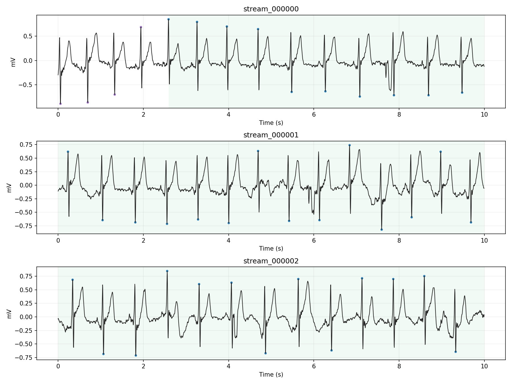

# Icentia11k 流式模拟（LSL）运行报告（run_20260209_163829）

这份报告对应一次“端到端”演示：把 Icentia11k 的 WFDB 数据（`.dat/.hea/.atr`）模拟成 **LSL 流式输入**，再把流式数据按 10 秒窗口写回 WFDB 三件套，并生成可视化图，方便你快速评估“流式输出效果”和“标注对齐是否正确”。

---

## 1. 这次我帮你跑了什么（结果在哪里）

本次运行的根目录：

- `ECG_Model/stream_result/run_20260209_163829/`

里面包含 3 类输出：

1) **写回的 WFDB 窗口数据（给大模型/下游模块用）**
- `ECG_Model/stream_result/run_20260209_163829/wfdb_250Hz/`
  - `RECORDS`：窗口索引文件（每行一个 record 名，不带扩展名）
  - `stream_000000.dat/.hea/.atr`
  - `stream_000001.dat/.hea/.atr`
  - `stream_000002.dat/.hea/.atr`

2) **可视化（快速看“流式效果 + 标注对齐”）**
- `ECG_Model/stream_result/run_20260209_163829/report/assets/250Hz/`
  - `summary.png`：前三个 10 秒窗口的汇总图
  - `stream_000000.png` / `stream_000001.png` / `stream_000002.png`：每个窗口单独一张图

3) **日志（定位问题用）**
- `ECG_Model/stream_result/run_20260209_163829/logs/`
  - `sender_250Hz.log`：Sender 推流日志
  - `receiver_250Hz.log`：Receiver 写盘日志
  - `plot_250Hz.log`：绘图日志

本次演示参数总结（关键）：
- 采样率：`fs_out=250Hz`（与原始一致，所以这次没有重采样）
- 推流分块：`chunk_ms=200ms`（约 50 点/块）
- 播放速度：`speed=20`（20 倍速）
- 写盘窗口：`window=10s`，`hop=10s`（不重叠）
- **rhythm 自描述注入**：开启（`--inject-rhythm-state`）

---

## 2. 先看结果图：怎么解读（你最关心的“效果评估”）

### 2.1 汇总图（推荐先看）


每个子图对应一个 10 秒窗口：
- 黑色曲线：ECG（单位 mV）
- 彩色背景：节律（rhythm）
  - NSR：淡绿色
  - AFIB：淡红色
  - AFL：淡黄色
- 散点：心拍级标注（beat），点的位置在标注 sample 对应的波形上

### 2.2 “节律自描述注入”是否生效？

你要求的策略是：**窗口开始如果已经处于某个节律，就在该窗口 `.atr` 的 sample=0 写一个 `'(XXX'`**，保证每个窗口都“自描述”。

这次运行可以在第二个窗口看到注入：
- `stream_000001.atr` 的第 1 条标注是：`sample=0, symbol='+', aux_note='(N'`
- 这表示：窗口开始时处于 `N`（映射成 NSR）

你可以用下面这段快速验证：

```bash
python - <<'PY'
import wfdb
ann = wfdb.rdann("ECG_Model/stream_result/run_20260209_163829/wfdb_250Hz/stream_000001", "atr")
print(list(zip(ann.sample[:5], ann.symbol[:5], ann.aux_note[:5])))
PY
```

### 2.3 非正常心拍（Q）示例：segment 45（可视化更直观）

前面主 run 是从 `p00000_s00` 的开头开始流式播放，前 30 秒几乎全是 `N`，所以 beat 散点颜色变化不明显。

为了让你更直观看到 **beat 标注确实会被叠加到波形上**，我额外又跑了一次短演示：
- 只播放 `p00000_s45`（这个 segment 开头就有很多 `Q`）
- 同样录制 3 个 10 秒窗口

对应的 WFDB 窗口文件在：
- `ECG_Model/stream_result/run_20260209_163829/wfdb_250Hz_qdemo_seg45/`

可视化在这里（注意开头的 `Q` 散点）：



---

## 3. 这套代码的结构（你要改参数/接大模型时会用到）

源码都在：
- `ECG_Model/code_for_stream/`

核心脚本分三类：

### 3.1 Sender：WFDB → LSL（流式模拟器）
- `ECG_Model/code_for_stream/sender_icentia_lsl.py`

它做的事：
- 读取 Icentia11k 的 WFDB record（默认 patient=0，segment 0~49）
- **输出 ECG stream**：连续 `float32`（mV），默认 250Hz
- **输出 ANN stream**：事件流（JSON 字符串），包含 beat 与 rhythm token
- 支持 `--fs-out` 做**真重采样**：
  - 波形：polyphase resample
  - 标注：按时间映射到新采样点（`round(t*fs_out)`）

LSL stream 命名（默认）：
- ECG：`icentia_ecg`
- ANN：`icentia_ann`

### 3.2 Receiver：LSL → WFDB（窗口写盘器）
- `ECG_Model/code_for_stream/receiver_lsl_to_wfdb.py`

它做的事：
- 订阅 `icentia_ecg` + `icentia_ann`
- 缓冲 ECG 样本，按 `window_sec/hop_sec` 切片
- 写出每个窗口的 WFDB 三件套：
  - `.dat/.hea`：波形
  - `.atr`：标注（beat + rhythm token）
- 写入 `.hea` 的 `comments`，记录对齐信息，例如：
  - `global_start_sample=...`
  - `source_record_at_start=p00000_s00`
  - `dataset_root=...`

**Receiver 为什么不会漏标注？（关键）**
- Sender 会定期在 ANN 流里发一个 watermark：`{"kind":"ecg_chunk_end","global_sample":...}`
- Receiver 只有在 `watermark >= window_end` 时才会“最终写盘”，从而避免高速推流时出现 “ECG 已到但标注还没到” 的情况

### 3.3 Viewer：实时评估（LSL 在线可视化）
- `ECG_Model/code_for_stream/viewer_lsl_realtime.py`

用途：
- 看“滚动波形 + beat 点 + 当前节律状态”
- `--no-plot` 模式可在无 GUI 环境打印速率等统计

---

## 4. 你如何最快复现（建议照这个顺序跑）

依赖安装：

```bash
python -m pip install -r ECG_Model/code_for_stream/requirements.txt
```

建议启动顺序（避免高倍速丢开头）：

1)（可选）Viewer：

```bash
python ECG_Model/code_for_stream/viewer_lsl_realtime.py
```

2) Receiver（写盘）：

```bash
python ECG_Model/code_for_stream/receiver_lsl_to_wfdb.py \
  --out-dir ECG_Model/stream_result/my_run/wfdb_250Hz \
  --window-sec 10 --hop-sec 10 \
  --inject-rhythm-state \
  --max-windows 10 \
  --verbose
```

3) Sender（推流）：

```bash
python ECG_Model/code_for_stream/sender_icentia_lsl.py \
  --dataset ECG_Model/dataset \
  --patient 0 \
  --fs-out 250 \
  --chunk-ms 200 \
  --speed 20 \
  --max-seconds 100 \
  --verbose
```

补充说明：
- Sender 默认 `--wait-for-consumers`：会等到 Receiver/Viewer 连接后才真正开始推流
- 如果你只想“单独跑 Sender”做压力测试：加 `--no-wait-for-consumers`

---

## 5. 参数怎么改（你后续一定会用到）

### 5.1 变更“流式速度”（强烈推荐）
- `sender_icentia_lsl.py --speed 1`：真实时间
- `--speed 20`：20 倍速（这次就是这样）
- `--speed 0`：尽可能快（可能会给 CPU/IO 很大压力）

### 5.2 变更“采样率”（真重采样）
- `--fs-out 200`：输出 200Hz（波形 + 标注 sample index 都映射到 200Hz）

### 5.3 变更“写盘窗口粒度”
当前你选择的是不重叠：
- `--window-sec 10 --hop-sec 10`

如果你以后要更“在线”的滑窗（例如 hop=5s），Receiver 需要扩展为支持重叠窗口（目前代码为了与你当前确认的方案一致，先限制 hop==window）。

### 5.4 控制推流块大小（延迟/开销权衡）
- `--chunk-ms 50`：更低延迟，但 Python push 次数更多
- `--chunk-ms 200`：较平衡（默认）
- `--chunk-ms 1000`：开销更低，但延迟更大

---

## 6. 如何接你的大模型（两条路线）

### 路线 A：大模型直接订阅 LSL（最“流式”）
你在模型侧做一个 buffer（例如 10 秒），每来一块 ECG 就 append；同时消费 ANN marker 做对齐或作为额外 token。

### 路线 B：用 Receiver 写成 WFDB 窗口，再喂给模型（你当前选择）
你只要遍历 `wfdb_250Hz/RECORDS`，对每个 record：
- 用 `wfdb.rdrecord()` 读波形（mV）
- 用 `wfdb.rdann(..., 'atr')` 读 beat + rhythm token

好处：
- 文件自包含、易调试、兼容你现有 WFDB 工具链
- 你要并行跑模型也容易（按 record 分发）

代价：
- 全量长时（58+ 小时）会产生很多文件（例如 10s 无重叠约 2 万个窗口）

---

## 7. 常见现象/问题（避免踩坑）

1) Receiver 日志里偶尔出现 `Stream transmission broke off... re-connecting`
- 这是 Sender 结束后 LSL 的正常重连提示，一般不用管

2) 高倍速下“窗口里没有标注”
- 这版用 watermark 解决了；如果你把 `watermark-every-chunks` 设太大，可能会变慢/等待 watermark

3) pylsl 报找不到 `liblsl`
- 本项目已经在 `ECG_Model/code_for_stream/vendor/lsl_lib/` vendored 运行时库
- `lsl_utils.import_pylsl()` 会自动加载（无需自己配 `LD_LIBRARY_PATH`）
